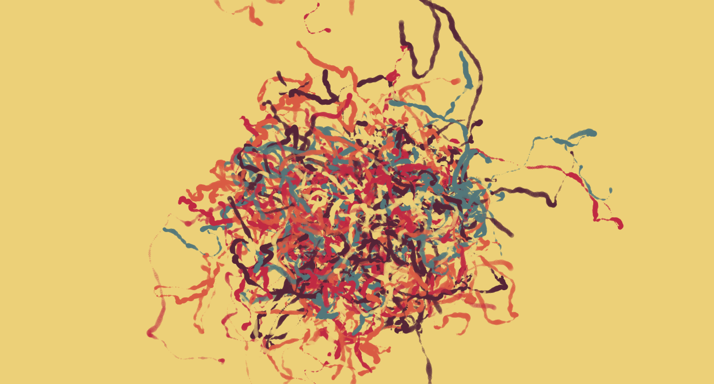
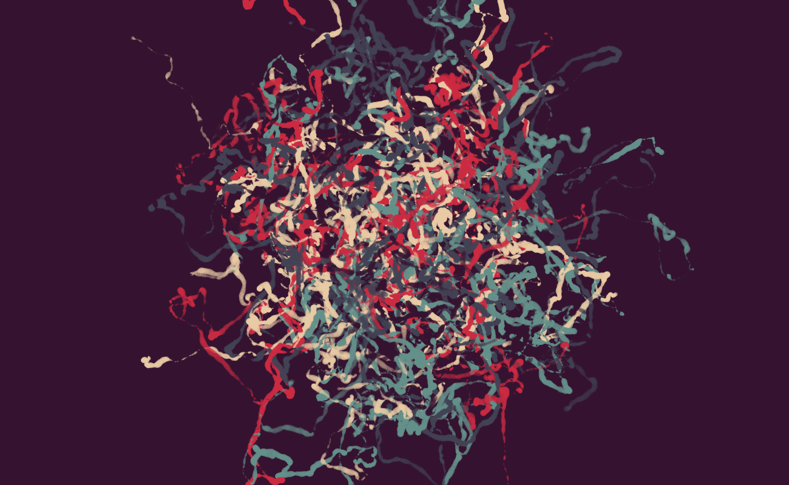
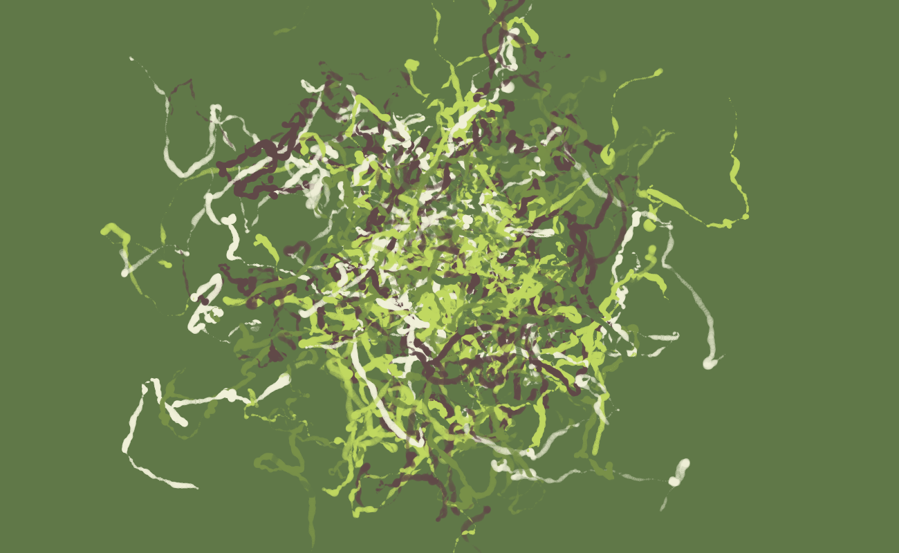

# Abstract Art
### Can use it to generate wallpapers :P

### Run: 
 - Run index.html (I recommend to use a LiveServer to run index.html on `localhost` (sometimes p5JS doesn't loadup correctely on raw index.html))
 
 :)
 
 Samples:
 
 

 

 

 

